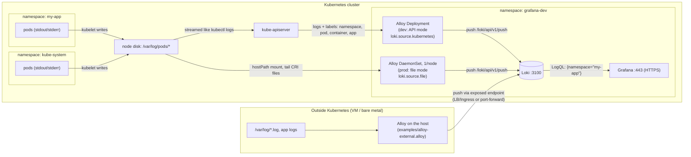
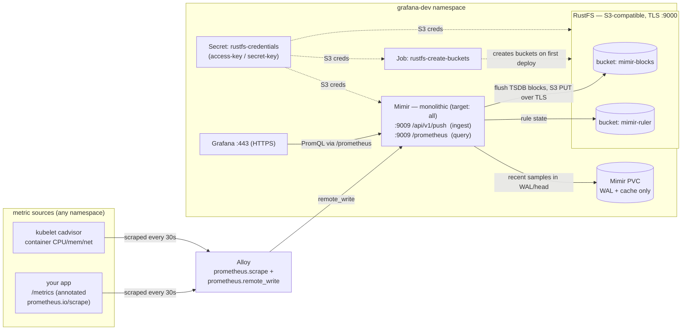

# grafana-k8s

Plain-YAML Kubernetes manifests for a complete Grafana observability stack in a
single namespace, **`grafana-dev`**:

| App | Signal | Store/Role |
| --- | --- | --- |
| **Grafana** | UI | Dashboards + Explore, served over HTTPS (full cert chain). |
| **Loki** | Logs | Log store. |
| **Prometheus** | Metrics | Metrics store (remote-write receiver enabled). |
| **Tempo** | Traces | Trace store + service-graph metrics generator. |
| **Pyroscope** | Profiles | Continuous-profiling store. |
| **Alloy** | Collector | One agent that collects logs, metrics, traces, and profiles and fans them out to the stores above. |
| **Mimir** (optional) | Metrics | Scale-out Prometheus alternative, self-contained in [grafana-dev-mimir/](grafana-dev-mimir/). |

Sized for **Docker Desktop's built-in Kubernetes**; the same files carry to
minikube, Tanzu, and managed clusters by changing the clearly marked
placeholders. No Helm, no operators — just `kubectl apply`.

```
                     ┌──────────── you (https) ─────────────┐
                     ▼                                       │
 apps ──logs──►  ┌───────┐ ──►  Loki        ◄──queries── ┌─────────┐
 apps ──metrics► │ Alloy │ ──►  Prometheus  ◄──queries── │ Grafana │
 apps ──OTLP───► │       │ ──►  Tempo       ◄──queries── │  :443   │
 apps ──pprof──► └───────┘ ──►  Pyroscope   ◄──queries── └─────────┘
```

## Layout

All stack manifests live flat in the repo root (one application stack, one
directory). Each app has its own `<app>-configmap.yaml` /
`<app>-deployment.yaml` / `<app>-svc.yaml`; **all PVCs are in the single
[pvcs.yaml](pvcs.yaml)**.

| Path | Purpose |
| --- | --- |
| [dashboards/](dashboards/) | **Dashboard JSON sources** — reusable in any Grafana (import or provision). |
| [certs/openssl.cnf](certs/openssl.cnf) | OpenSSL config (SANs, key usage) for the Grafana cert — used by the dev script and reusable for production CSRs. |
| [certs/generate-certs.sh](certs/generate-certs.sh) | Self-signed CA + full-chain cert → `grafana-tls` Secret (dev/simulation). |
| [examples/alloy-external.alloy](examples/alloy-external.alloy) | Collect from hosts **outside** Kubernetes (VMs, bare metal). |
| [prometheus-file-sd/](prometheus-file-sd/) | **Dynamic Prometheus targets** — migrate big `static_configs` (Windows/SNMP/blackbox) to `file_sd` without redoing dashboards. |
| [docs/correlation.md](docs/correlation.md) | Wire up the 4 signal jumps (log→trace, metric→trace via exemplars, trace→profile). |
| [docs/meta-monitoring.md](docs/meta-monitoring.md) | Monitor the stack itself — official mixins, label contract, recording rules. |
| [docs/alerting.md](docs/alerting.md) | Alertmanager vs Grafana-managed alerting, mixin alerts, starter rules. |
| [examples/alloy-logs-daemonset-tanzu.yaml](examples/alloy-logs-daemonset-tanzu.yaml) | Production per-node log collection (DaemonSet). |
| [grafana-dev-mimir/](grafana-dev-mimir/) | Optional standalone Mimir (own PVC included). |

## Placeholders to replace for production

| Placeholder | Where | Replace with |
| --- | --- | --- |
| `grafana.example.com` | [grafana-configmap.yaml](grafana-configmap.yaml), [certs/openssl.cnf](certs/openssl.cnf) | Real URL, or `https://<ip>:<port>` in `root_url`. |
| `loadBalancerIP: 10.0.0.100` | [grafana-svc-loadbalancer.yaml](grafana-svc-loadbalancer.yaml) | Your LB IP, or delete to auto-assign. |
| `storageClassName: hostpath` | [pvcs.yaml](pvcs.yaml), [grafana-dev-mimir/mimir-pvc.yaml](grafana-dev-mimir/mimir-pvc.yaml) | See the per-distribution table below. |
| self-signed certs | [certs/](certs/) | Real chain — see "TLS in production" below. |
| `admin / admin` | [grafana-deployment.yaml](grafana-deployment.yaml) | Secret-backed `GF_SECURITY_ADMIN_PASSWORD`. |
| `cluster = "docker-desktop"` | [alloy-configmap.yaml](alloy-configmap.yaml), Tempo/Prometheus configs | Your cluster name. |

## Deploy: all steps, start to finish

### Step 1 — Prerequisites

A Kubernetes cluster (Docker Desktop / minikube / Tanzu / managed), `kubectl`
pointed at it, and `openssl`.

```bash
kubectl config use-context docker-desktop     # or your context
kubectl get nodes
```

### Step 2 — Namespace

```bash
kubectl apply -f namespace.yaml               # creates grafana-dev
```

### Step 3 — All PVCs (one file)

```bash
kubectl apply -f pvcs.yaml
kubectl -n grafana-dev get pvc
```

Adjust `storageClassName` first if you're not on Docker Desktop (table below).

### Step 4 — TLS certs

Dev/simulation (self-signed, automated):

```bash
./certs/generate-certs.sh
```

Production: see **TLS in production** below, then create the same
`grafana-tls` Secret from your real files.

### Step 5 — Storage backends

```bash
kubectl apply -f loki-configmap.yaml -f loki-deployment.yaml -f loki-svc.yaml
kubectl apply -f prometheus-configmap.yaml -f prometheus-deployment.yaml -f prometheus-svc.yaml
kubectl apply -f tempo-configmap.yaml -f tempo-deployment.yaml -f tempo-svc.yaml
kubectl apply -f pyroscope-configmap.yaml -f pyroscope-deployment.yaml -f pyroscope-svc.yaml
```

### Step 6 — Alloy (the collector)

```bash
kubectl apply -f alloy-rbac.yaml -f alloy-configmap.yaml -f alloy-deployment.yaml -f alloy-svc.yaml
```

### Step 7 — Grafana (config, dashboards, deployment)

```bash
kubectl apply -f grafana-configmap.yaml -f grafana-dashboards-configmap.yaml -f grafana-deployment.yaml
```

Datasources (Prometheus, Loki, Tempo, Pyroscope) and the dashboards in
[dashboards/](dashboards/) are provisioned automatically.

### Step 8 — Expose Grafana: pick ONE Service variant

```bash
kubectl apply -f grafana-svc-loadbalancer.yaml   # Option A: LoadBalancer
# or
kubectl apply -f grafana-svc-clusterip.yaml      # Option B: port-forward
```

### Step 9 — Verify and access

```bash
kubectl -n grafana-dev get pods,svc,pvc
# Option A (Docker Desktop): open https://localhost/
# Option A (real LB):        open https://<LB-IP>/ or https://grafana.example.com/
# Option B:
kubectl -n grafana-dev port-forward svc/grafana 3000:3000   # then https://localhost:3000/
```

Login `admin` / `admin` (change on first login). Dashboards → **Kubernetes**
folder → logs + container metrics are already populated.

## Changing config: what needs a restart

Not all config reloads the same way — this catches people out.

| Change | Takes effect |
| --- | --- |
| **Dashboard JSON** ([dashboards/](dashboards/) → its ConfigMap) | **Automatic.** Grafana rescans the provisioned directory (~30 s) + kubelet ConfigMap sync (~60 s). No restart. |
| **Grafana config** ([grafana-configmap.yaml](grafana-configmap.yaml)) — `grafana.ini`, **datasources** | **Requires `rollout restart`** ⚠️ |
| **Alloy / Loki / Tempo / Prometheus / Mimir configs** | Requires a `rollout restart` (or a reload endpoint where the component has one). |

```bash
kubectl apply -f grafana-configmap.yaml
kubectl -n grafana-dev rollout restart deploy/grafana     # <-- do not skip
```

> ### ⚠️ Why Grafana's config needs the restart: `subPath`
> `grafana.ini`, `datasources.yaml`, and `dashboards.yaml` are mounted with
> **`subPath`** (they're individual files inside shared directories). Kubernetes
> **never updates `subPath` mounts** when the ConfigMap changes — and editing a
> ConfigMap doesn't trigger a Deployment rollout either. So `kubectl apply` +
> `rollout status` will both report success while Grafana quietly keeps serving
> the **old** config. Verified the hard way on a live cluster.
>
> The dashboards ConfigMap mounts a **whole directory** (no `subPath`), which is
> exactly why it *does* auto-update.

> **Removing a provisioned datasource doesn't delete it.** Grafana stores
> provisioned datasources in its database; commenting one out leaves it in
> place. Delete it in the UI or use a `deleteDatasources:` block.

## Dashboards

The [dashboards/](dashboards/) directory is the **source of truth**:

- `kubernetes-logs.json` — log volume + error rate by namespace, live log viewer (Loki).
- `kubernetes-containers.json` — per-pod CPU / memory / network from cadvisor (Prometheus).
- `tempo-traces.json` — request/error rate + p95 latency per service (from Tempo's span metrics) and a recent-traces search table (Tempo).

Use them anywhere: **import** into any Grafana (Dashboards → New → Import →
upload the JSON), or **provision** them here by regenerating the ConfigMap
after adding/editing files:

```bash
kubectl create configmap grafana-dashboards -n grafana-dev \
  --from-file=dashboards/ --dry-run=client -o yaml | kubectl apply -f -
```

Grafana rescans every 30 s — no restart needed. Keep
[grafana-dashboards-configmap.yaml](grafana-dashboards-configmap.yaml) in sync
(same command, redirect to the file).

> ⚠️ **Don't `kubectl apply -f .` in the repo root.** It applies *both* Grafana
> Service variants ([grafana-svc-clusterip.yaml](grafana-svc-clusterip.yaml) and
> [grafana-svc-loadbalancer.yaml](grafana-svc-loadbalancer.yaml)) — same
> Service name, so whichever lands last silently wins. Follow the numbered
> steps and pick one variant in Step 8.

## Collecting logs on different Kubernetes distributions

How every log line reaches Grafana — from cluster namespaces (either
collection mode) and from machines outside Kubernetes:



Pick ONE of the two in-cluster paths per environment — running both ships
every line twice:

- **API mode** (this repo's default, [alloy-configmap.yaml](alloy-configmap.yaml)):
  a single Alloy Deployment streams logs through the Kubernetes API
  (`loki.source.kubernetes`). Unprivileged, zero node access. Right choice for
  single-node/dev clusters; on big clusters it loads the API server.
- **DaemonSet mode** ([examples/alloy-logs-daemonset-tanzu.yaml](examples/alloy-logs-daemonset-tanzu.yaml)):
  one Alloy per node tails `/var/log/pods/*` files directly
  (`loki.source.file`, CRI parsing). Scales with nodes — the production
  choice. Needs root + hostPath, i.e. a `privileged` namespace. When you
  enable it, remove the LOGS section from the main Alloy config so lines
  aren't shipped twice.

| Distribution | Log collection | StorageClass (PVCs) | Reaching Grafana |
| --- | --- | --- | --- |
| **Docker Desktop** | API mode as-is (single node). | `hostpath` (default, already set) | `LoadBalancer` maps to `https://localhost/`. |
| **minikube** | API mode for 1 node; DaemonSet if you run `minikube start --nodes=N`. | `standard` (default provisioner) | Run `minikube tunnel` in a terminal, then the LB gets an IP; or use the ClusterIP variant + port-forward. |
| **Tanzu (TKG/TKGS)** | **DaemonSet mode.** TKG ≥ 1.26 enforces `restricted` Pod Security by default — first: `kubectl label --overwrite ns grafana-dev pod-security.kubernetes.io/enforce=privileged` (label prepared, commented, in [namespace.yaml](namespace.yaml); on old PSP-based TKG bind `vmware-system-privileged` instead). | Your vSphere storage-policy class, e.g. the commented `tanzu-storage-computer` in [pvcs.yaml](pvcs.yaml) (`kubectl get storageclass` to list) | `LoadBalancer` gets an IP from NSX ALB / HAProxy — set `loadBalancerIP` or let it auto-assign. |
| **Managed (EKS / GKE / AKS)** | DaemonSet mode (multi-node). Default PSA is usually permissive, but check cluster policies. | `gp3` (EKS) / `standard-rwo` (GKE) / `managed-csi` (AKS) | `LoadBalancer` provisions a cloud LB; consider an Ingress + cert-manager instead. |

The log *file* layout (`/var/log/pods/<ns>_<pod>_<uid>/<container>/*.log`) is
standard kubelet behaviour, so the DaemonSet config is identical on all of
them — only the security/storage/LB knobs above differ.

Apps **outside** any cluster (VMs, bare metal): run Alloy on the host with
[examples/alloy-external.alloy](examples/alloy-external.alloy) — file logs,
host metrics, OTLP traces, and pprof profiles to the same backends.

### Logs from other namespaces (all namespaces, by default)

You do **not** deploy anything per namespace. The shipped setup already collects
logs from **every namespace** cluster-wide:

- `discovery.kubernetes "pods" { role = "pod" }` in
  [alloy-configmap.yaml](alloy-configmap.yaml) has **no namespace filter**, so it
  discovers pods in all namespaces.
- The `alloy` **ClusterRole**/**ClusterRoleBinding** in
  [alloy-rbac.yaml](alloy-rbac.yaml) grant `pods` + `pods/log` cluster-wide —
  that's what actually authorizes reading logs outside `grafana-dev`. (A
  namespaced `Role` would silently limit Alloy to its own namespace.)

Every line is labelled with its `namespace`, `pod`, `container`, `node`, and
`app`, so in Grafana you select any namespace with LogQL:

```logql
{namespace="kube-system"}          # control-plane / system pods
{namespace="my-app"}               # your app
{namespace=~"team-.*"}             # regex across many namespaces
{namespace="my-app", app="api"}    # narrow by the app label
```

**Prove it end to end** — deploy a log generator in a brand-new `demo`
namespace and watch it show up:

```bash
kubectl apply -f examples/demo-app-other-namespace.yaml
# Grafana -> Explore -> Loki:   {namespace="demo"}
kubectl delete -f examples/demo-app-other-namespace.yaml   # clean up
```

**Want only specific namespaces?** Add a `namespaces` block to the discovery so
Alloy watches just those (lighter on the API server on big clusters):

```alloy
discovery.kubernetes "pods" {
  role = "pod"
  namespaces {
    names = ["my-app", "team-a", "kube-system"]
  }
}
```

**Want everything except a few noisy namespaces?** Keep the cluster-wide
discovery and drop the unwanted ones with a relabel rule in
`discovery.relabel "pod_logs"`:

```alloy
rule {
  source_labels = ["__meta_kubernetes_namespace"]
  regex         = "kube-system|kube-node-lease"
  action        = "drop"
}
```

Both approaches work identically in DaemonSet (file) mode — the same
`namespaces` block / namespace relabel applies to `loki.source.kubernetes` and
to the file-discovery relabels.

## Collecting metrics, traces, and profiles from your apps

### cadvisor (container metrics) — nothing to deploy

cadvisor is **built into the kubelet** on every Kubernetes node (Docker
Desktop, minikube, Tanzu, EKS/GKE/AKS alike) — do NOT deploy a separate
cadvisor DaemonSet, it would only duplicate the metrics. The setup here works
like this:

1. Alloy discovers the cluster's nodes (`discovery.kubernetes "nodes"` in
   [alloy-configmap.yaml](alloy-configmap.yaml)).
2. For each node it scrapes
   `https://kubernetes.default/api/v1/nodes/<node>/proxy/metrics/cadvisor` —
   the kubelet's embedded cadvisor endpoint, reached through the API server
   using Alloy's ServiceAccount token (RBAC: `nodes/proxy` in
   [alloy-rbac.yaml](alloy-rbac.yaml)).
3. The samples (`container_cpu_usage_seconds_total`,
   `container_memory_working_set_bytes`, `container_network_*`, … each
   labelled with `namespace`/`pod`) are remote-written to Prometheus/Mimir.

Verify it's flowing: `up{job="prometheus.scrape.cadvisor"}` should be `1` in
Explore → Prometheus. Note for dashboards: use `container=""` to select the
per-pod aggregate series (portable across distros — some, like Docker
Desktop, don't emit per-container name labels).

### Everything else

- **Container CPU/mem/network**: automatic via cadvisor, as above.
- **App metrics** (any namespace): expose `/metrics` and annotate the pod:
  ```yaml
  annotations:
    prometheus.io/scrape: "true"
    prometheus.io/port: "8080"
    prometheus.io/path: "/metrics"   # optional
  ```
- **Traces**: `OTEL_EXPORTER_OTLP_ENDPOINT=http://alloy.grafana-dev.svc.cluster.local:4318`
- **Profiles**: copy the `pyroscope.scrape` block in
  [alloy-configmap.yaml](alloy-configmap.yaml) and point it at any `/debug/pprof` endpoint.

## TLS in production (certs, chain, cnf)

Grafana terminates TLS itself. It needs three files, mounted from the
`grafana-tls` Secret and referenced in `grafana.ini`
([grafana-configmap.yaml](grafana-configmap.yaml)):

| grafana.ini key | Secret key | Content |
| --- | --- | --- |
| `cert_file` | `tls.crt` | **Full chain**: server cert first, then intermediate CA(s), then (optionally) root — in that order. |
| `cert_key` | `tls.key` | The private key for the server cert. |
| `ca_cert` | `ca.crt` | The CA / chain bundle, for clients that need to trust it. |

**1. Generate the key + CSR using the provided cnf.**
Edit [certs/openssl.cnf](certs/openssl.cnf) first: set the real `CN` and add
every DNS name / IP users will type as a SAN (browsers validate SANs, not CN).

```bash
openssl genrsa -out grafana.key 2048
openssl req -new -key grafana.key -config certs/openssl.cnf -out grafana.csr
```

**2. Submit `grafana.csr` to your CA** (corporate CA, or a public one). You
get back the signed certificate and the CA chain (root + intermediates).

**3. Build the full chain** — order matters (leaf → intermediate → root):

```bash
cat grafana.crt intermediate.crt root.crt > fullchain.crt
cat intermediate.crt root.crt > ca-chain.crt
```

**4. Create the Secret** (exactly what the Deployment mounts):

```bash
kubectl -n grafana-dev create secret generic grafana-tls \
  --type=kubernetes.io/tls \
  --from-file=tls.crt=fullchain.crt \
  --from-file=tls.key=grafana.key \
  --from-file=ca.crt=ca-chain.crt
```

**5. Match the URL**: set `domain` / `root_url` in
[grafana-configmap.yaml](grafana-configmap.yaml) to the same name as the cert
SAN, and restart Grafana (`kubectl -n grafana-dev rollout restart deploy/grafana`).

For dev, [certs/generate-certs.sh](certs/generate-certs.sh) automates all five
steps with a local self-signed CA (it uses the same `openssl.cnf`, so the dev
cert is structurally identical to the production one). Renewal = repeat steps
2–4; the Secret update is picked up on the next pod restart.

## Optional: Mimir (+ RustFS object storage) instead of Prometheus

[Grafana Mimir](https://grafana.com/oss/mimir/)
([docs](https://grafana.com/docs/mimir/latest/)) is the horizontally-scalable,
long-term metrics store. The deployment in
[grafana-dev-mimir/](grafana-dev-mimir/) is self-contained (same `grafana-dev`
namespace) and stores its blocks in **RustFS**, an S3-compatible object store
served over TLS — see the full guide in
[grafana-dev-mimir/README.md](grafana-dev-mimir/README.md):

### Deploy Mimir + RustFS from scratch (every step)

Run these in order. Each step says what it creates and how to confirm it before
moving on. All of it lands in the `grafana-dev` namespace.

**Step 0 — Prerequisite: the namespace exists.** (Created in the main stack's
Step 2; run this if you're doing Mimir standalone.)

```bash
kubectl apply -f namespace.yaml
```

**Step 1 — S3 credentials → `rustfs-credentials` Secret.** One Secret is read by
*three* consumers: the RustFS server, Mimir (S3 client), and the bucket Job.
Generate strong random keys (recommended — it prints them once, save them):

```bash
./grafana-dev-mimir/generate-rustfs-credentials.sh
# dev-only alternative (checked-in placeholders):
#   kubectl apply -f grafana-dev-mimir/rustfs-secret.example.yaml
kubectl -n grafana-dev get secret rustfs-credentials      # confirm it exists
```

**Step 2 — TLS cert for RustFS → `rustfs-tls` Secret.** RustFS serves its S3
API over HTTPS, so it needs a cert whose SANs cover its in-cluster names (full
breakdown in [TLS certs for RustFS](#tls-certs-for-rustfs-what-generate-rustfs-certssh-does)
below):

```bash
./grafana-dev-mimir/generate-rustfs-certs.sh
kubectl -n grafana-dev get secret rustfs-tls              # confirm it exists
```

**Step 3 — storage claims** (RustFS data 30Gi + Mimir WAL/cache 20Gi):

```bash
kubectl apply -f grafana-dev-mimir/mimir-pvc.yaml
kubectl -n grafana-dev get pvc                            # both should Bind
```

**Step 4 — RustFS server + service**, then wait for it to be Ready:

```bash
kubectl apply -f grafana-dev-mimir/rustfs-deployment.yaml \
              -f grafana-dev-mimir/rustfs-svc.yaml
kubectl -n grafana-dev rollout status deploy/rustfs
```

**Step 5 — create Mimir's buckets** (`mimir-blocks` + `mimir-ruler`) via the
one-shot, idempotent Job, and wait for it to complete:

```bash
kubectl apply -f grafana-dev-mimir/rustfs-create-buckets-job.yaml
kubectl -n grafana-dev wait --for=condition=complete job/rustfs-create-buckets --timeout=120s
```

**Step 6 — Mimir itself** (config + deployment + service), then wait for Ready:

```bash
kubectl apply -f grafana-dev-mimir/mimir-configmap.yaml \
              -f grafana-dev-mimir/mimir-deployment.yaml \
              -f grafana-dev-mimir/mimir-svc.yaml
kubectl -n grafana-dev rollout status deploy/mimir
```

**Step 7 — verify the whole path is up:**

```bash
kubectl -n grafana-dev get pods -l 'app in (rustfs, mimir)'
kubectl get --raw "/api/v1/namespaces/grafana-dev/services/mimir:9009/proxy/ready"
# browse the buckets/objects in the RustFS console:
kubectl -n grafana-dev port-forward svc/rustfs 9001:9001   # http://localhost:9001
```

**Step 8 — wire it into the stack** (send metrics in, and query them out):

```bash
# Ingest: point Alloy remote_write at Mimir (the config already dual-writes;
# uncomment/keep the Mimir endpoint), then restart Alloy:
kubectl apply -f alloy-configmap.yaml
kubectl -n grafana-dev rollout restart deploy/alloy

# Query: uncomment the Mimir datasource in grafana-configmap.yaml, then:
kubectl apply -f grafana-configmap.yaml
kubectl -n grafana-dev rollout restart deploy/grafana
```

> **Shortcut:** after Steps 1–2 you can `kubectl apply -f grafana-dev-mimir/`
> to apply everything at once — Kubernetes retries until ordering resolves. The
> explicit sequence above just avoids transient "bucket not found"/"connection
> refused" errors while things come up, and gives you a checkpoint per step.

### TLS certs for RustFS (what `generate-rustfs-certs.sh` does)

RustFS serves its S3 endpoint over TLS, so Mimir connects to it with `https`.
The [generate-rustfs-certs.sh](grafana-dev-mimir/generate-rustfs-certs.sh) script
automates the four steps below for **dev**; for **production** run the same
steps with your real CA. RustFS requires the files to be named **exactly**
`rustfs_cert.pem` and `rustfs_key.pem`.

**Step 1 — self-signed CA** (skip in production; use your real CA instead):

```bash
openssl genrsa -out ca.key 4096
openssl req -x509 -new -nodes -key ca.key -sha256 -days 3650 \
  -subj "/O=RustFS Dev/CN=RustFS Dev CA" -out ca.crt
```

**Step 2 — server key + CSR** for the in-cluster service name:

```bash
openssl genrsa -out rustfs_key.pem 2048
openssl req -new -key rustfs_key.pem \
  -subj "/CN=rustfs.grafana-dev.svc.cluster.local" -out rustfs.csr
```

**Step 3 — write the SAN config** (`.cnf` extfile) and sign the cert. The SANs
are what clients validate, so they must cover every name Mimir uses to reach
RustFS. Create `san.cnf`:

```ini
subjectAltName   = DNS:rustfs, DNS:rustfs.grafana-dev, DNS:rustfs.grafana-dev.svc, DNS:rustfs.grafana-dev.svc.cluster.local, DNS:localhost, IP:127.0.0.1
extendedKeyUsage = serverAuth
```

Then sign with it:

```bash
openssl x509 -req -in rustfs.csr -CA ca.crt -CAkey ca.key -CAcreateserial \
  -days 825 -sha256 -extfile san.cnf -out rustfs_cert.pem
```

**Step 4 — load the `rustfs-tls` Secret** (RustFS mounts the cert/key; Mimir
mounts `ca.crt` to trust it):

```bash
kubectl -n grafana-dev create secret generic rustfs-tls \
  --from-file=rustfs_cert.pem=rustfs_cert.pem \
  --from-file=rustfs_key.pem=rustfs_key.pem \
  --from-file=ca.crt=ca.crt \
  --dry-run=client -o yaml | kubectl apply -f -
```

Change the namespace or validity with the `NAMESPACE` / `DAYS` env vars the
script honours (defaults `grafana-dev` / `825`). Dev outputs land in the
git-ignored `grafana-dev-mimir/certs-out/`. The script **verifies the chain
before it deploys** (`openssl verify -CAfile ca.crt rustfs_cert.pem` + a SAN
check), so a broken cert fails here instead of surfacing later as a Mimir
connection error.

#### Making the chain verify (no "unable to get local issuer" / SAN errors)

Every client that reaches RustFS (**Mimir** via `tls_ca_path`, the **bucket
Job** via `AWS_CA_BUNDLE`) does full verification — `insecure: false`, no
skip-verify. Two rules keep that from failing:

1. **The served cert must be a *full chain*.** RustFS presents `rustfs_cert.pem`
   to clients; that file must contain the **leaf first, then every
   intermediate**, up to (but not including) the root. Clients only hold the
   **root/CA** in `ca.crt`. If an intermediate is missing from the served file,
   verification fails with `unable to get local issuer certificate` even though
   the cert is otherwise valid. In dev there are no intermediates (the CA signs
   the leaf directly), so `rustfs_cert.pem` = the single leaf and `ca.crt` = the
   CA. With a real CA:

   ```bash
   # served cert = leaf + intermediate(s), in that order (leaf first):
   cat rustfs.crt intermediate.crt > rustfs_cert.pem
   # trust bundle clients verify against = root (+ intermediates is fine too):
   cat root.crt > ca.crt        # or: cat intermediate.crt root.crt > ca.crt
   ```

2. **The name must be in a SAN, not just the CN.** Modern TLS validates the
   hostname against `subjectAltName`. Mimir connects to
   `rustfs.grafana-dev.svc.cluster.local:9000`, so that exact name must be a
   `DNS:` SAN (Step 3 covers all the in-cluster forms). A cert with only a CN
   throws `certificate is valid for …, not …`.

Verify by hand any time (same checks the script runs):

```bash
openssl verify -CAfile ca.crt rustfs_cert.pem                 # must print "OK"
openssl x509 -in rustfs_cert.pem -noout -ext subjectAltName   # must list the name
# end to end, from inside the cluster:
kubectl -n grafana-dev exec deploy/mimir -- \
  openssl s_client -connect rustfs.grafana-dev.svc.cluster.local:9000 \
  -CAfile /etc/rustfs-ca/ca.crt -verify_return_error </dev/null
```

The **same two rules** apply to Grafana's own cert (browsers are the clients) —
see [TLS in production](#tls-in-production-certs-chain-cnf), which builds the
leaf→intermediate→root `fullchain.crt` the identical way.

> **Production:** in Step 1 skip the self-signed CA and submit `rustfs.csr`
> (Step 2) to your real CA. Assemble `rustfs_cert.pem` as the full chain
> (rule 1) and put your root CA in `ca.crt`, then load `rustfs-tls` with the
> same three key names above.

### How a metric reaches Grafana — every component



Step by step, a single sample's journey:

1. **Produce** — a metric originates either from *your app* (it exposes
   `/metrics` and the pod is annotated `prometheus.io/scrape: "true"`, any
   namespace) or from the *kubelet's built-in cadvisor* (container CPU / memory
   / network — nothing to deploy).
2. **Collect** — the single **Alloy** agent scrapes both every 30s
   (`prometheus.scrape` in [alloy-configmap.yaml](alloy-configmap.yaml)) and
   tags samples with `cluster` external labels.
3. **Ship** — Alloy `remote_write`s to **Mimir** at
   `:9009/api/v1/push`. This is the *same* wire protocol Prometheus uses, so
   switching stores is just a URL change — the shipped config **dual-writes**
   to Prometheus *and* Mimir; delete one `endpoint` block to keep a single store.
4. **Ingest** — Mimir runs **monolithic** (`target: all` — all its internal
   components in one process) and accepts the write on `:9009`, holding recent
   samples in its head/WAL on the local **Mimir PVC** (fast, short-lived; *not*
   the long-term home).
5. **Persist** — Mimir periodically compacts the head into TSDB **blocks** and
   flushes them to the **`mimir-blocks`** bucket in **RustFS** over S3/**TLS**
   (`:9000`). Credentials come from the shared **`rustfs-credentials`** Secret;
   the **`rustfs-create-buckets`** Job creates the buckets on first deploy. This
   is the durable, grow-independently store — the whole point of using Mimir.
6. **Query** — Grafana's Mimir datasource sends **PromQL** to
   `:9009/prometheus`. Mimir transparently answers from the head (PVC) for
   recent data and from blocks (RustFS) for older data — the caller never knows
   which.
7. **Visualize** — the same dashboards in [dashboards/](dashboards/) render the
   result; only the datasource behind them changed.

Its in-cluster links:

| Use | URL |
| --- | --- |
| Grafana datasource (query) | `http://mimir.grafana-dev.svc.cluster.local:9009/prometheus` |
| Alloy `remote_write` (ingest) | `http://mimir.grafana-dev.svc.cluster.local:9009/api/v1/push` |
| Local UI/API check | `kubectl -n grafana-dev port-forward svc/mimir 9009:9009` → http://localhost:9009 |

Both swaps are pre-written as comments: the `remote_write` URL in
[alloy-configmap.yaml](alloy-configmap.yaml) and the Mimir datasource in
[grafana-configmap.yaml](grafana-configmap.yaml).

## Teardown

```bash
kubectl delete namespace grafana-dev
kubectl delete clusterrole/alloy clusterrolebinding/alloy
```

## License

Licensed under the [Apache License 2.0](LICENSE).
